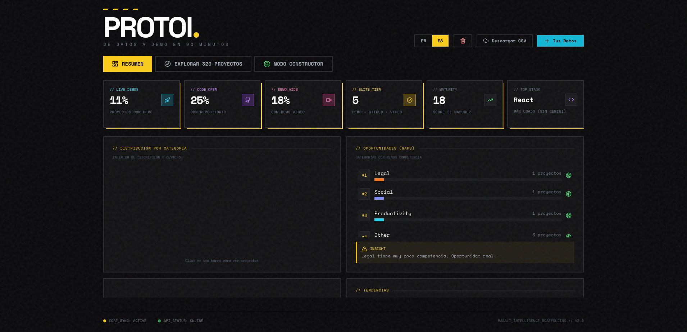
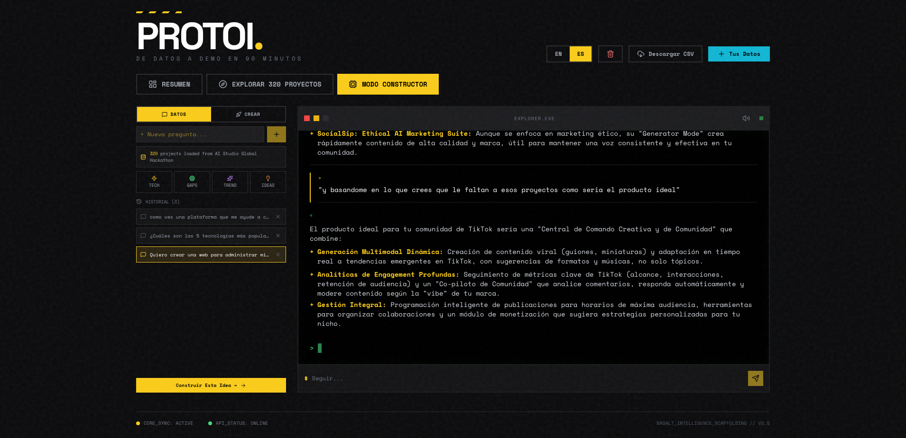
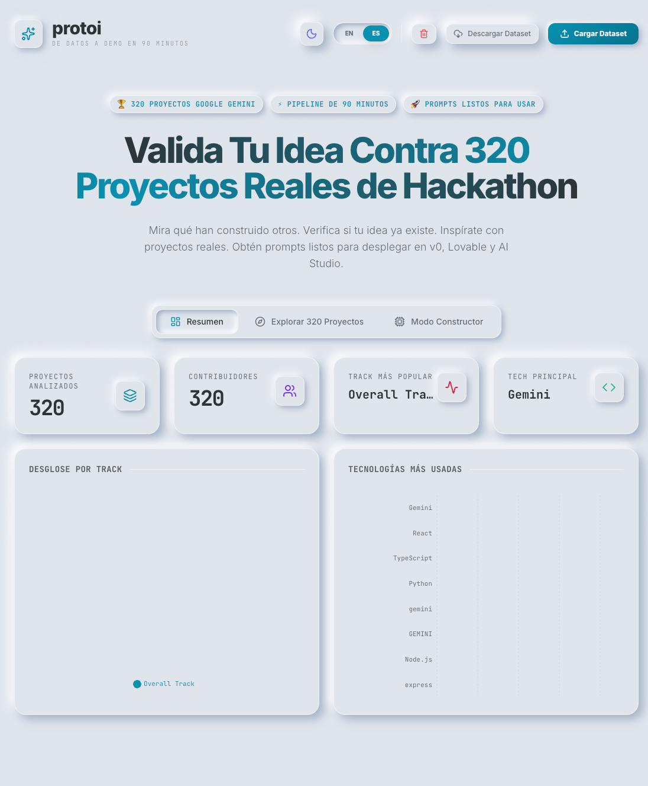
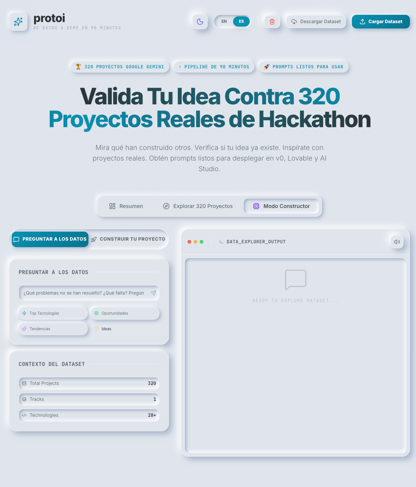
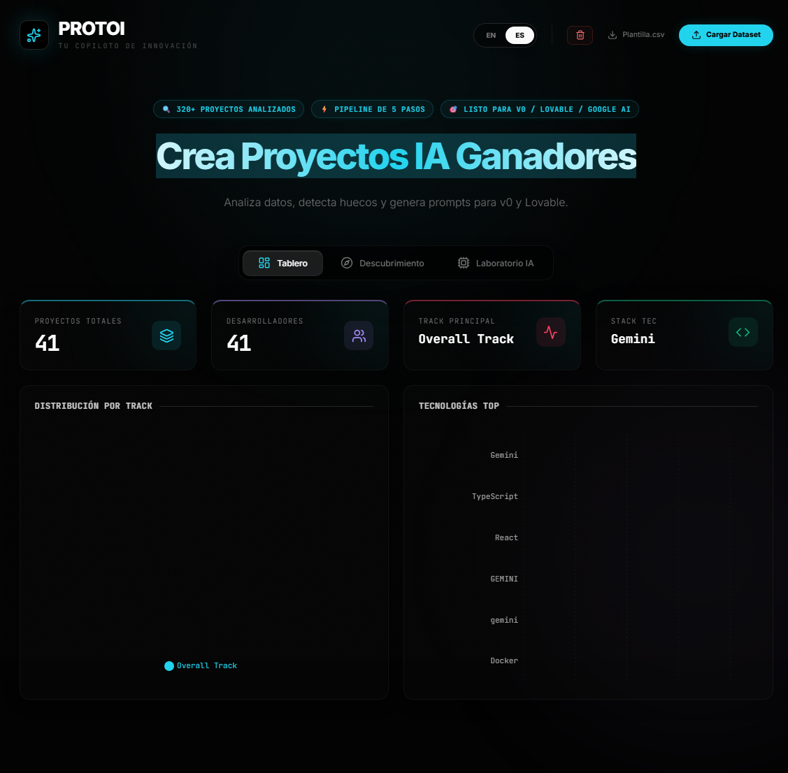
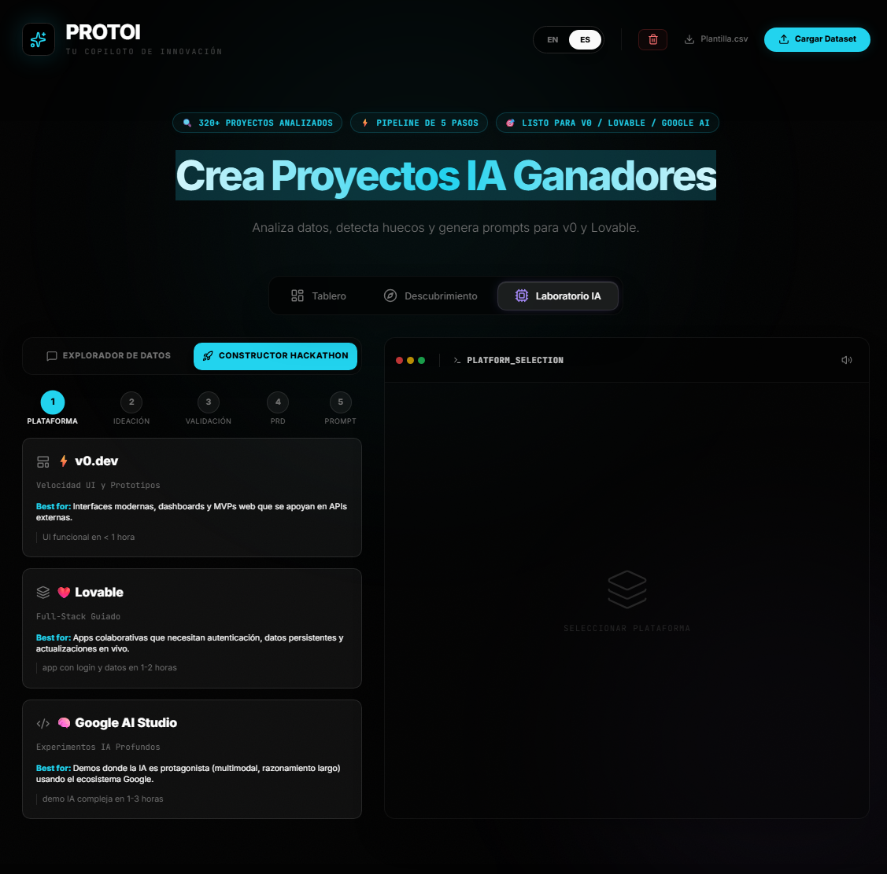

# protoi

**Validate your hackathon idea against 320 real Google Gemini projects.**

Stop building what already exists. Explore what's been done, find the gaps, and get ready-to-deploy prompts for v0, Lovable, and Google AI Studio—all in 90 minutes.

[](LICENSE)
[](https://protoi.milumon.dev/)

[🚀 Try It Now](https://protoi.milumon.dev/) • [Report Bug](https://github.com/Atypical-Playworks/protoi/issues) • [Request Feature](https://github.com/Atypical-Playworks/protoi/issues/new)

---

## 💡 Why This Exists

I participated in a hackathon with 320+ Google Gemini projects submitted. Analyzing those submissions manually was impossible. 

So I built **protoi** — a tool that:
- Lets you search and explore all 320 projects instantly
- Uses AI to identify gaps and unbuilt ideas
- Generates deployment-ready prompts for modern builder tools

If you're about to start a hackathon project, this dataset is your competitive advantage.

---

## 🌓 Latest Design - Flash UI Integration

Latest iteration featuring Flash UI integration with streaming code preview, advanced builder pipeline, and enhanced user experience.

<div align="center">
  
  
</div>

<details>
<summary>📸 View Previous Versions</summary>

### Neumorphic Design (Previous Version)
<div align="center">
  
  
</div>

### Original Design (Deprecated)
<div align="center">
  
  
</div>

*Previous versions maintained for reference*

</details>

---

## 🎯 What You Can Do

### 1️⃣ **Browse 320 Projects** 
Search by technology, track, or AI capabilities. See what people actually built with Gemini.

**Filters:**
- 🧠 Complex Problem Solving (reasoning-heavy apps)
- 👁️ Image & Video AI (multimodal vision)
- ⚡ Real-Time Apps (live streaming, low latency)
- 🗣️ Voice & Audio AI (speech, TTS/STT)
- 📚 Long-Context Analysis (RAG, document processing)
- 🛠️ AI Agents & Tools (function calling, grounding)

### 2️⃣ **Ask The Data**
Natural language chat with the entire dataset. Examples:
- *"What healthcare problems haven't been solved?"*
- *"Show me projects that failed at monetization"*
- *"What's missing in the education space?"*

### 3️⃣ **Build Your Project (90-Minute Pipeline)**
Guided workflow from idea to deployment-ready prompt:

1. **Choose Platform** → v0.dev, Lovable, or Google AI Studio
2. **Describe Idea** → Natural language or "surprise me" mode
3. **Validate** → AI checks if it's been done, finds similar projects
4. **Generate PRD** → High-level product requirements document
5. **Get Prompt** → Copy-paste ready prompt for your chosen platform

**Time estimates:**
- v0.dev: Working prototype in < 1 hour
- Lovable: Full app with auth in 1-2 hours  
- Google AI Studio: Advanced AI demo in 1-3 hours

---

## 🚀 Quick Start

```bash
# Clone the repo
git clone https://github.com/Atypical-Playworks/protoi.git
cd protoi

# Install dependencies
pnpm install

# (Optional) Add your Gemini API key for AI Lab features
cp .env.example .env 

# Start dev server
pnpm dev
```

Visit `http://localhost:5173`

**Note:** You can explore all 320 projects without an API key. The Gemini API is only needed for the "AI Lab" chat and builder features.

---

## 📊 What's In The Dataset

**320 projects** from the Google Gemini API Developer Competition, including:

- Project name, description, and track
- Technologies used (TensorFlow, React, Python, etc.)
- Team size
- Gemini capabilities leveraged (vision, audio, reasoning, context window)
- Links to demos, GitHub repos, and YouTube videos (when available)

**Most popular tracks:**
- Health & Medical AI
- Education & Learning Tools  
- Creative & Content Generation
- Developer Tools & Productivity

**Most used technologies:**
- Gemini 1.5 Pro/Flash
- React/Next.js
- Python
- TypeScript
- TensorFlow

---

## 🛠️ How It Works

### For Explorers
1. Dataset loads automatically (320 projects cached locally)
2. Use search bar or capability filters to find relevant projects
3. Click any project to see full details

### For Builders
1. Go to **Build Mode** (AI Lab)
2. Choose **"Ask The Data"** to discover gaps
3. Switch to **"Build Your Project"** when ready
4. Follow the 5-step pipeline: Platform → Idea → Validation → PRD → Prompt
5. Copy your deployment prompt and paste it into v0, Lovable, or AI Studio

---

## 🎨 Tech Stack

Built for speed and simplicity:
- React 19 + TypeScript
- Vite 6 (dev server)
- Tailwind CSS (neumorphic design system)
- Google Gemini API (AI analysis)
- Recharts (data visualization)
- PapaParse (CSV parsing)

---

## 🤝 Contributing

Found a bug? Have an idea? Contributions welcome!

1. Fork the repo
2. Create a feature branch (`git checkout -b feature/amazing-idea`)
3. Commit your changes (`git commit -m 'Add amazing feature'`)
4. Push to the branch (`git push origin feature/amazing-idea`)
5. Open a Pull Request

---

## 📄 License

MIT License - Free and open source.

See [LICENSE](LICENSE) for details.

---

## 🙏 Credits

> **Built for those who need it. By someone who did.**

*I competed in the Gemini 3 AI Studio Hackathon. After submission, I discovered that 320 projects had been submitted—but they weren't publicly accessible until the hackathon ended. Once they were released, I wanted to analyze my competition and learn from every submission. The problem? Manually reviewing 320 projects was impossible. So I built a scraper to collect all the data, then built protoi to make sense of it all. I don't know if I'll be among the winners, but with protoi, I'm walking away with insights from all 320 competitors.*

**A project by [Atypical-Playworks](https://github.com/Atypical-Playworks)**  
**Developed by [Milumon](https://github.com/Milumon)**
